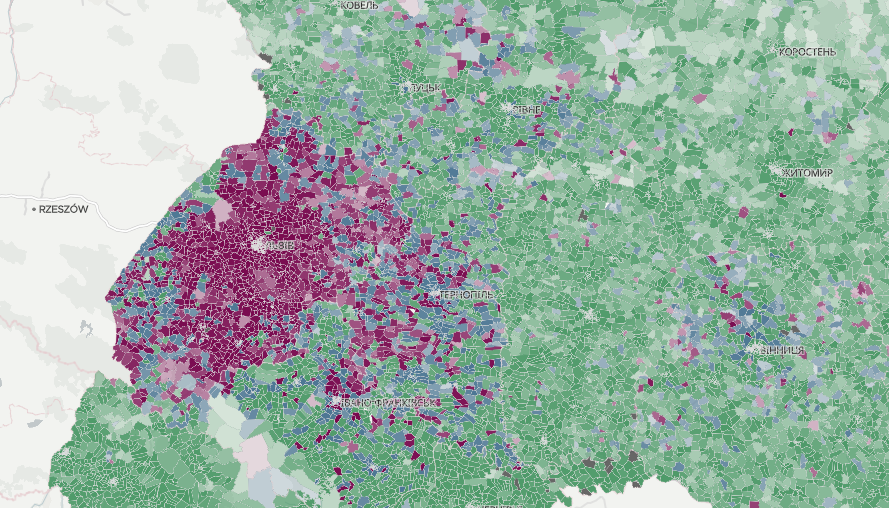

# Як створювати інтерактивні карти з власними векторними тайлами (vector tile) за допомогою mapbox-gl.js 

Для чого це потрібно? Векторні тайли дозволяють створювати карти з __величезною кількістю елементів__ і запрограмувати їм __бажані стилі__. Карти при цьому не втрачають в продуктивності і легко будуть завантажуватися як на десктопах так і на мобільних телефонах без суттєвих затримок.  

Наприклад, ми використали векторні тайли для карти результатів другого туру Президентських виборів в Україні весною 2019 року.

## Частина перша. Як створити кастомний векторний тайлами (vector tile) для карти.

[Vector tile](https://docs.mapbox.com/vector-tiles/reference/ "vector tiles mapbox") або векторний тайл, це ефективний спосіб зберігати і використовувати геодані. Ми будемо користуватися векторними тайлами у форматі mbtiles. Це архів всередині якого знаходяться бінарні файли. Кожен файл описує всі елементи, що видно на карті при певному зумі в певній точці. Це така "плитка" на яку розбирата вся карта. На зумі 1, весь свій це одна "плитка", чим більший зум тим більше потрібно "плиток", щоб покрити всю карту і, відповідно тим більшими і важчим буде mbtiles архів, але з іншого боку можна буде відобразити більше деталей на карті.  

Детальніше про те якими бувають зуми (великими і маленькими) можна почати за на сайті бібліотеки 
[leaflet.js](https://leafletjs.com/examples/zoom-levels/ "leaflet docs")  

Більшость інструментів, які ми будемо використовувати створила команда mapbox, на їх сайті можна знайти документацію, описи і поради. Перше, що нам потрібно робити для того, щоб почати працювати з векторними тайлами це перетворити наш файл з геопросторовими даними в тайл. Для прикладу, ви можете скористатися файлом example.geojson, з цього репозиторія.  

Я намалював його на цьому [сайті](http://geojson.io/ "geojson.com"). В цьому файлі кілька полігонів, ліній і маркерів в Києві і околицях. Що ми з ним зробимо:  

* Перетворимо файл з геоданими в проекцію EPSG:4326.
* Перетворимо geojson або шейпфайл (.shp) з правильною проекцією його в mbtiles.
* Перевірити чи в mbtiles є ті елементи, що нам потрібні і, що вони відображаються правильно.
* Розархівуємо mbtiles.

Для того, щоб змінити проекцію вам можна використати утиліту [ogr2ogr](https://gdal.org/programs/ogr2ogr.html "ogr2ogr"). Вона є частиною бібліотеки [GDLA](https://gdal.org/ "GDAL"). За посилання на утиліту можна почитати її документацію і подивитися, що означають різні параметри. У нашому випадку, потрібна одна проста команда: 

`
ogr2ogr -f GeoJSON example_4326.geojson -t_srs EPSG:4326 example.geojson
`  

example.geojson - це наш початковий файл, example_4326.geojson назва файлу який ми хочемо отримати на виході. Важливо, що ogr2ogr не стане перезаписувати файл, якщо у папці вже буде файл з такою ж назвою і викине вам помилку.

Потрібно зробити це для того, щоб підготувати геоджейсон
ogr2ogr -f GeoJSON your_data_in_4326.json -t_srs EPSG:4326 your_data.shp

Бібліотека, що вміє створювати тайл з geojson, тут можна почитати доки
https://github.com/mapbox/tippecanoe

elections_v7.mbtiles - тайли
tippecanoe -o output.mbtiles -z12 -Z4 --coalesce-densest-as-needed --generate-ids input.geojson

захостити тайл онлайн
sudo docker run -it -v $(pwd):/data -p 8080:80 klokantech/tileserver-gl elections_v7.mbtiles

Все, що ми робили вище я дізнався з цього [туторіалу](https://openmaptiles.org/docs/generate/custom-vector-from-shapefile-geojson/ "openmaptiles")

Ця штука дозволяє перетворити mbite файл в статичну папку з тайлами
https://github.com/klokantech/vector-tiles-sample

Код який потрібно запустити. Спочатку в папці де mbile файл, а тоді перейти в середину створеної папки (тут countries) і запустити дві наступні. Вони розпаковують і перейменовують. 
В кінці потрібно перейменувати json file 
./mb-util --image_format=pbf countries.mbtiles countries
gzip -d -r -S .pbf *
find . -type f -exec mv '{}' '{}'.pbf \;

